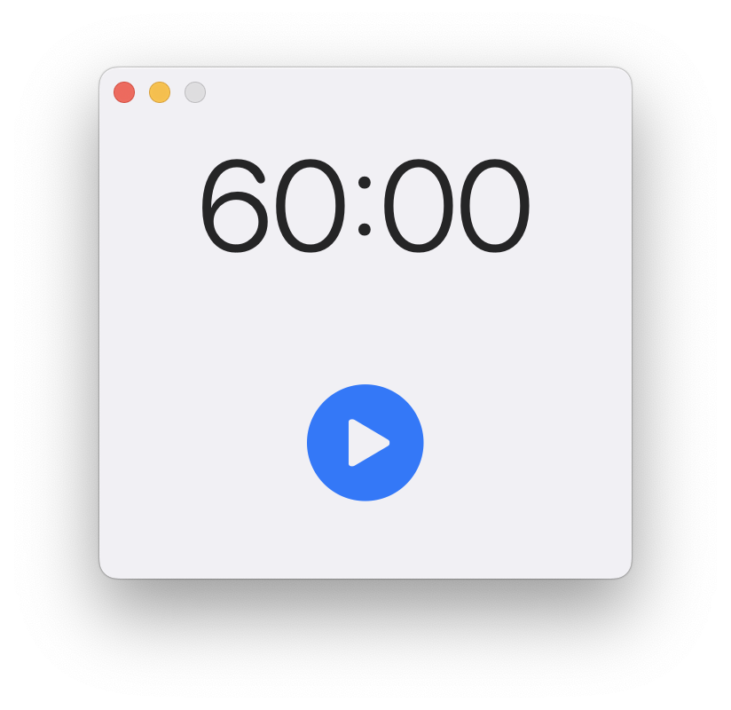
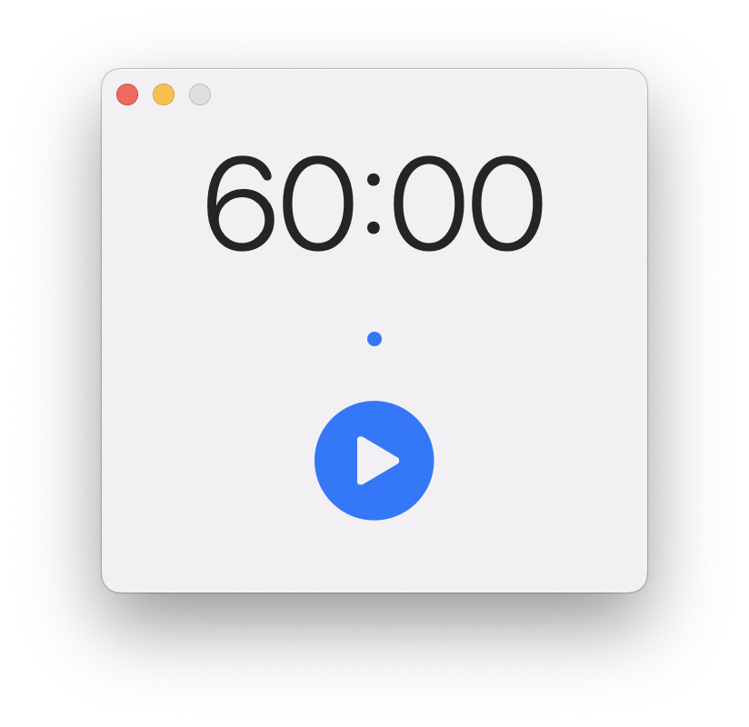
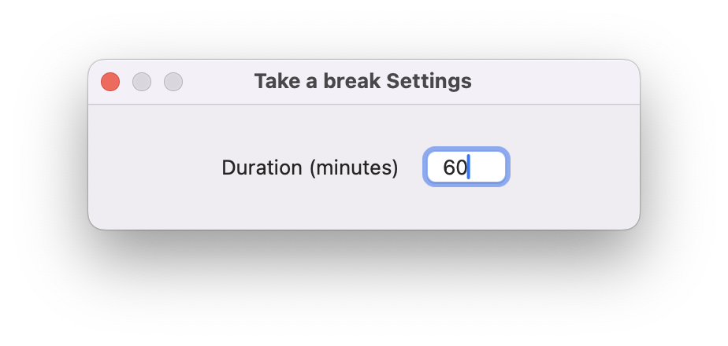
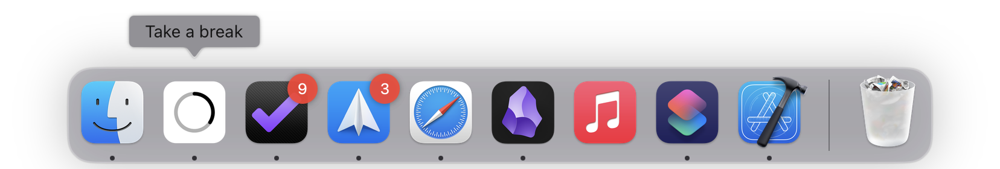

# Take a Break

A minimalist macOS timer application designed to help you maintain a healthy work-break balance. This app lives in your menu bar and dock and helps you remember to take regular breaks from your work.

## Features

- 🕒 Customizable timer duration (default: 25 minutes)
- 🔔 System notifications when it's time for a break
- 🔊 Audio alerts when timer completes
- 📊 Visual progress tracking in both menu bar and dock icon
- ⌨️ Keyboard shortcuts for quick control - cmd+r to reset, space to start/pause, cmd+, to open preferences
- 🎯 Break counter with hearts for every 5 breaks completed
- 💻 Floating window with a simple UI

## Screenshots

 

## Installation

1. Release coming to the Appstore soon.

## Usage

### Basic Controls
- **Start/Pause**: Click the play/pause button or press the spacebar
- **Reset Timer**: Press `⌘R` or use the menu bar option
- **Access Preferences**: Use the standard macOS preferences shortcut `⌘,`

### Menu Bar
The app displays a circular progress indicator in your menu bar:
- Circle: Time remaining
- Click the indicator to show the main window
- Small dots show completed breaks
- Hearts appear for every 5 breaks completed

### Preferences
You can customize:
- Timer duration (in minutes)

### Notifications
The app will notify you when it's time to take a break using:
- System notifications (requires permission)
- Audio alert sound
- Visual indicators in menu bar and dock

## Technical Details

Built with:
- SwiftUI
- macOS native notifications
- Menu bar integration
- Dock icon customization

The code in this repo is not production ready. It's a simple app I built to try and learn SwiftUI and macOS development, but feel free to take a look around. 

## Requirements

- macOS 15.1 or later
- Apple Silicon or Intel processor

## Credits

Created by Joel Brewster
