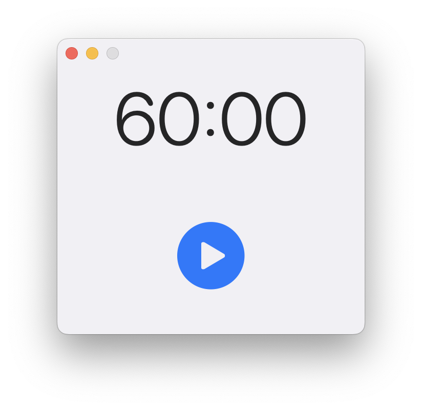
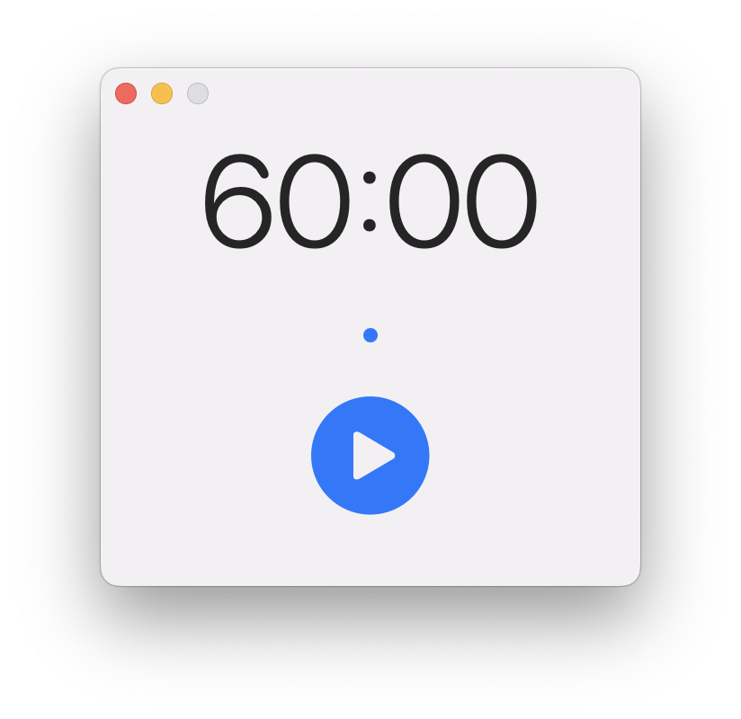
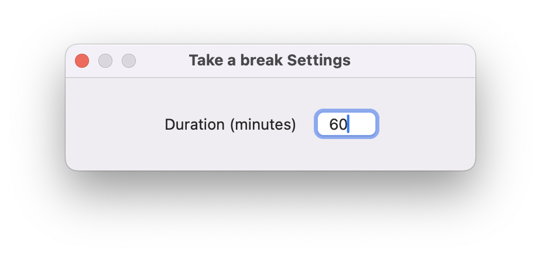
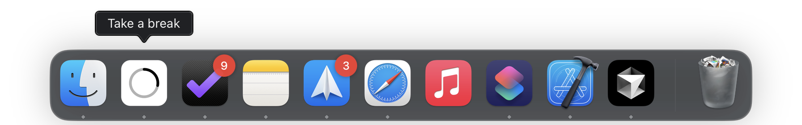

# Take a Break

A minimalist macOS timer application designed to help you maintain a healthy work-break balance. This app lives in your menu bar and dock and helps you remember to take regular breaks from your work.

## Features

- 🕒 Customizable timer duration (default: 25 minutes)
- 🔔 System notifications when it's time for a break
- 📊 Visual progress tracking in both menu bar and dock icon
- ⌨️ Keyboard shortcuts for quick control - cmd+r to reset, space to start/pause, cmd+, to open preferences
- 🎯 Break counter to track your daily breaks
- 💻 Floating window with a simple UI

## Screenshots

 

## Installation

1. Download the latest release from the releases page
2. Move "Take a Break.app" to your Applications folder
3. Launch the application
4. Grant notification permissions when prompted

## Usage

### Basic Controls
- **Start/Pause**: Click the play/pause button or press the spacebar
- **Reset Timer**: Press `⌘R` or use the menu bar option
- **Access Preferences**: Use the standard macOS preferences shortcut `⌘,`

### Menu Bar
The app displays a circular progress indicator in your menu bar:
- Circle: Time remaining
- Click the indicator to show the main window

### Preferences
You can customize:
- Timer duration (in minutes)

### Notifications
The app will notify you when it's time to take a break using:
- System notifications
- Audio alert
- Visual indicators

## Technical Details

Built with:
- SwiftUI
- macOS native notifications
- Menu bar integration
- Dock icon customization

The code in this repo is not production ready. It's a simple app I built to try and learn SwiftUI and macOS development, but feel free to take a look around. 

## Requirements

- macOS 15.1 or later
- Apple Silicon or Intel processor

## Credits

Created by Joel Brewster

## License

Creative Commons Attribution-NonCommercial (CC BY-NC)

This work is licensed under the Creative Commons Attribution-NonCommercial 4.0 International License. To view a copy of this license, visit http://creativecommons.org/licenses/by-nc/4.0/ or send a letter to Creative Commons, PO Box 1866, Mountain View, CA 94042, USA.

You are free to:
- Share — copy and redistribute the material in any medium or format
- Adapt — remix, transform, and build upon the material

Under the following terms:
- Attribution — You must give appropriate credit, provide a link to the license, and indicate if changes were made
- NonCommercial — You may not use the material for commercial purposes
